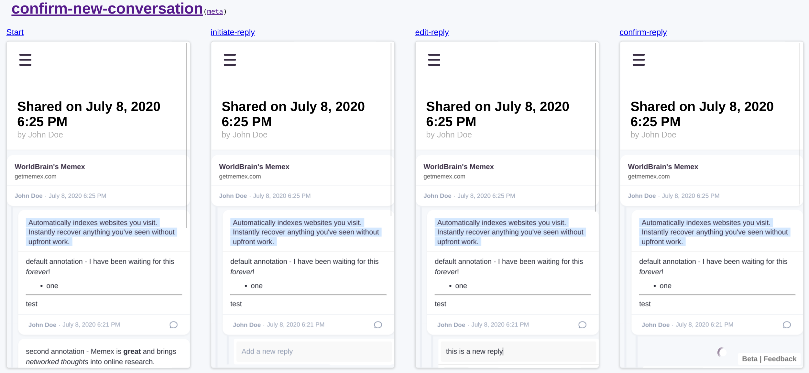

import NewsletterLink from "../../components/newsletter-link";
import AnimationFrames from "../../components/animation-frames";
import { ScenarioReplaysFollowUps } from "../../features/posts/components/scenario-replays";

If you’re building software products of non-trivial complexity, you’re probably already doing some form of automated testing. As your product grows, the amount of things you’d have to test before each release quickly becomes unmanageable, which is why we write programs to behave as users would do. However, normally these tests run invisibly and at the end only show us whether they pass or fail. What if instead we could visualize these tests and jump to any position in the program covered by a test and continue interacting manually from there?

<AnimationFrames
  width={1614}
  height={1250}
  frames={[
    "/2022-02-11-scenario-01-cropped.png",
    "/2022-02-11-scenario-02-cropped.png",
    "/2022-02-11-scenario-03-cropped.png",
    "/2022-02-11-scenario-04-cropped.png",
    "/2022-02-11-scenario-05-cropped.png",
  ]}
/>

 
Better yet, what if we could visually lay out the entire sequence of such an automated
test in an overview UI, just as we do in design documentation?
 
 

These automated tests which you can quickly visually jump into and continue interacting
with are what I call scenario replays, which can not only shorten the communication
cycles between people on your team, but generally make development much more fun!

## Why you want scenario replays

When you’re developing something, you often repeatedly go through the cycle of editing code, waiting for it to compile, manually doing a few actions in the UI and seeing whether the result works. What if we could eliminate the manual part, which can take anywhere from 3 to 30 seconds per code change? With scenario replays, we just define the steps that need to happen and instantly see the result of every code change. This can drastically **shorten the iteration cycle** developers go through most of their day, making their work much more fun.

Fiddling with CSS styles is not the best use of skilled programmers’ time. So, in WorldBrain, skilled developers only write the actual business logic and put the basic structure of the UI in place, writing scenarios as they go. Then, we send a link with the scenario reproduction to the CEO (we’re two devs + the CEO who also does design), who can then jump straight to bits that need styling and write the necessary CSS. By **lowering the effort to offload styling, we can free up precious developer time **and prevent them from working underneath their skill level.

Loading screens and errors are often not easy to style, but important to get right. To style them, you need to know the exact points in the code to edit to reproduce these states, after which they’re often neglected because you don’t encounter them often. In scenarios, you can go to specific loading and error states and keep them in the library of scenarios, so it’s **easier to offload styling more easily and maintain the quality of these more hidden states**.

When bugs occur, often a lot of time is spent communicating back and forth how to reproduce a bug. What we actually want is to be able to have a special bug reproduction environment where every UI action taken is recorded and converted into a scenario, which developers then can use to directly reproduce the errors on their own machines, so they can start investigating and fixing it right away. This **reduces the back-and-forth needed to report and fix bugs**, which often can be time consuming for everyone involved.

Lastly, with some extra work, it’s possible to lay out all the workflows in the UI visually like shown above. This means that rather than having design documentation that is always out of sync with the actual product, now you can start having design docs directly generated from code, meaning you have **design docs that can never go out of sync**. But the real fun part is restyling: you can **immediately see how style changes affect your entire product**.

## How to implement scenario replays

Every product has their unique design challenges and technical constraints, so how you implement scenario replays is highly context dependent. Also, getting the overview UI to run is an extra layer on top of the scenario replays, better suited for a next article. On a high-level, for the scenario replays themselves you’ll need:

- **The ability to start your program with the right pre-conditions:** what data do you need pre-loaded in the database? What users are registered and which one is logged in? Is there anything stored in cookies or local storage?
- **The ability to replay and record user actions:** this is achieved easiest by centralizing your UI event handling, but can be done in different ways influencing how well your scenarios will keep working as you change your program (you don’t want to be storing CSS selectors and simulating click events for example) and how easy it is to serialize them so you can send and store them.

In order to get the full benefits of scenario replays, you’ll want them to be as performant as possible. If you can get a scenario replay to run in a few milliseconds, it means that during your daily development workflow you can instantly see the results of your changes, while the overview UI can display a lot of your product workflows while still staying responsive.

How much effort you’ll want to put in to get this infrastructure running depends on your needs. If you’re a startup starting from scratch, making some early design decisions pays off big time even in the short run (1-2 weeks.) If you’re a bigger organization with more technical constraints, I’d calculate how much time and motivation is wasted on a daily basis by the issues highlighted above so you can compare that with the time you need to get a proof of concept running and increasing adoption over time. In any case, I wish your team lots of fun resulting from these shorter iteration cycles!

## What’s next?

I’ll dive into the most interesting aspects of implementing scenario replays in your product in the _scenario replays and cross-team collaboration_ series. If you want to receive articles as they come out, you can <NewsletterLink>subscribe to the series by joining the mailing list</NewsletterLink>.

<ScenarioReplaysFollowUps current="/blog/scenario-replays" />
